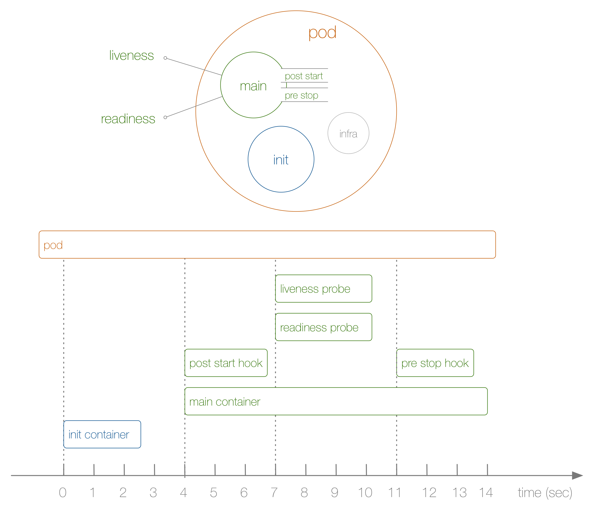
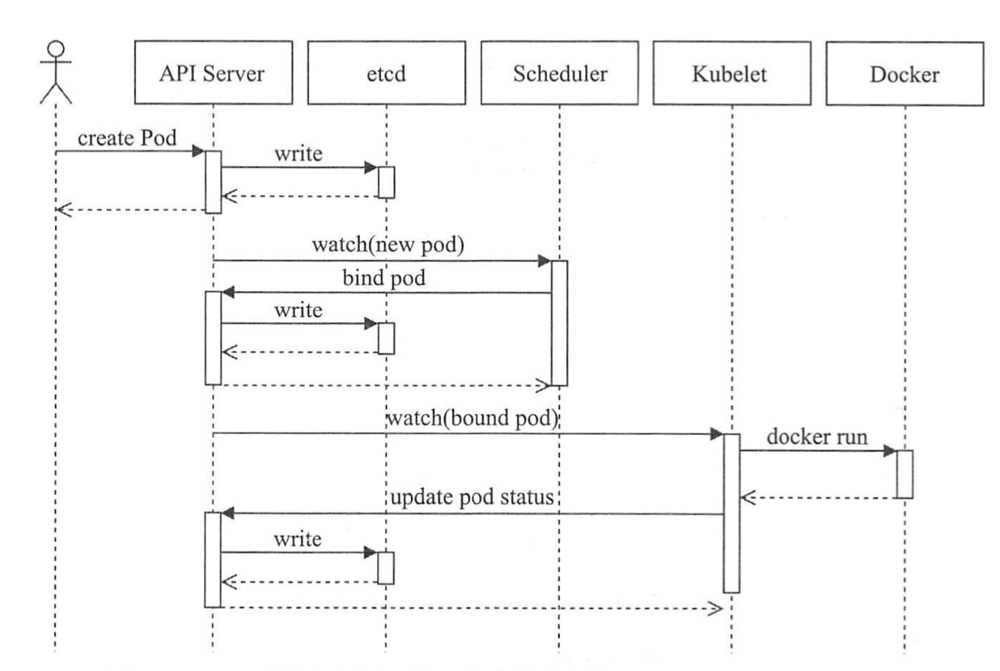
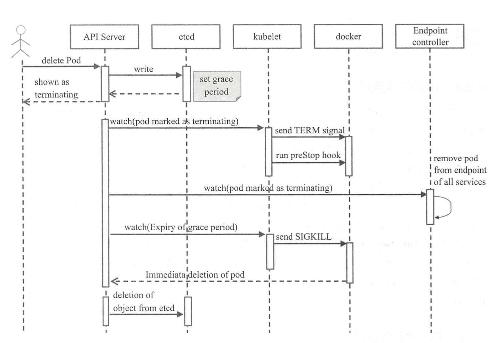

## POD使用

#### 基本的POD资源创建
```yaml
apiVersion: v1
kind: Pod
metadata:
  name: pod-example
spec:
  containers:
  - name: myapp
    image: ikubernetes/myapp:v1
```
POD创建使用命令`kubectl apply -f test.yaml` 或 `kubectl create -f test.yam;`, 更新同样可使用`kubectl apply`, 建议使用第一种

获取当前POD状态命令 `kubectl get -f test.yaml`或 `kubectl get pod`

 根据元数据过滤`kubectl get -f test.yaml -o custom-columns=NAME:metadata.name,STATUS:status.phase`, 过滤使用`custom-columns`参数

删除POD使用命令 `kubectl delete -f test.yaml` 或者直接删除 `kubectl delete pod [pod-name]`

参数描述
- apiVersion            表示当前使用的API版本
- kind                  表示要创建的资源类型
- metadata              表示资源的元数据，这里可以写标签，作者信息等元数据
- metadata.name         表示POD的名称
- spec.containers       容器相关配置
- spec.containers.name  容器名称
- spec.containers.image 容器使用的镜像

## POD资源对象管理
#### Pod镜像策略（imagePullPolicy）
1. Always: 镜像标签为 "latest"或景象不存在时总是从远程仓库获取景象
2. IfNotPresent: 仅本地仓库没有的时候才会去远程仓库下载景象, 它也是默认POD景象的默认策略
3. Never: 禁止从远程仓库下载景象，只使用本地，哪怕本地没有也不会去下载
   
例如下面配置策略为`Always`
```yaml
apiVersion: v1
kind: Pod
metadata:
  name: nginx-pod
spec:
  containerts:
  - name: nginx-test
    image: nginx:latest
    imagePullPolicy: Always
```
#### 端口暴露
参数：
- containerPort <integer>       必选字段， 指定在Pod对象的IP上暴露的容器端口范围(0-65535),使用时应该指定容器应用的正常监听端口
- name  <string>                当前端口的名称， 必须符合IANA_SVC_NAME规范且当前Pod内必须以为， 此名称可被Service资源调用
- protocol                      端口相关的协议， 其值可以是TCP或UDP， 默认为TCP
  
可以通过`kubectl explain pods.spec.containers.ports`  查看帮助

实例
```yaml
apiVersion: v1
kind: Pod
metadata:
  name: pod-test
spec:
  containers:
  - name: myapp
    image: ikubernetes/myapp:v1
    imagePullPolicy: IfNotPresent
    ports:
    - name: http
      containerPort: 80
      protocol: TCP
```

创建实例： `kubectl apply -f test.yaml`

#### 自定义运行应用
在docker中可以通过ENTRYPOINT指令进行定义， 传递参数则通过CMD指令， ENTRYPOINT不存在的时候，可以通过CMD同时指定程序和参数

docker查询运行参数

`docker inspect ikubernetes/myapp:v1 -f {{.Config.Cmd}}`

`docker inspect ikubernetes/myapp:v1 -f {{.Config.Entrypoint}}`

在k8s中通过command字短来指定默认运行的应用程序， 并且同时使用args字段进行参数传递， 他们将覆盖景象中的默认定义

如果仅仅定义了command字段， 那么它将覆盖景象定义的程序以参数， 并以无参数的方式运行应用

实例：
```yaml
apiVersion: v1
kind: Pod
metadata:
  name: pod-with-custom-command
spec:
  containers:
  - name: myapp
    image: alpine:latest
    command: ["/bin/sh"]
    args: ["-c ", "while true;do sleep 30;done"]
```

#### 环境变量
参数:
  name <string>       环境变量的名称， 必选字段
  value <string>      传递给环境变量的值， 通过$(VAR_NAME)引用， 逃逸格式为 $$(VAR_NAME)， 默认值为空

实例
```yaml
apiVersion: v1
kind: Pod
metadata:
  name: pod-with-env
spec:
  containers:
  - name: filebeat
    image: ikubernetes/filebeat:5.6.5-alpine
    env:  # 定义环境变量
    - name: REDIS_HOST
      value: db.ilinux.io:6379
    - name: LOG_LEVEL
      value: info
```

#### 共享节点的网络名称空间
同一个Pod对象的容器都会运行一个独立的隔离的Network名称空间，通向同一个网络协议栈，以及相关的网络设备。

```yaml
apiVersion: v1
kind: Pod
metadata:
  name: pod-use-hostnetwork
spec:
  containers:
  - name: hostmyapp
    image: ikubernetes/myapp:v1
  hostNetwork: true  # 共享主机网路名称空间
  hostPID: true   # 共享主机的PID名称空间
  hostIPC: true   # 共享主机的IPC名称空间
```
#### 设置 Pod 对象的安全上下文
[x] 基于用户 ID (UID)和组 ID (GID)控制访问对象(如文件)时的权限

[x] 以特权或非特权的方式运行

[x] 通过 Linux Capabilities 为其提供部分特权 

[x] 基于 Seccomp过滤进程的系统调用

[x] 基于 SELinux 的安全标签

[x] 是否能够进行权限升级 

Pod对象的安全上下文定义在 spec.securityContext字段中, 容器的安全上线文规则在spec.containers[].securityContext字段中 

实例
```yaml
apiVersion: v1
kind: Pod
metadata:
  name: pod-with-securitycontext
spec:
  containers:
  - name: busybox
    image: busybox
    command: ["/bin/sh", "-c", "sleep 86400"]
    securityContext:
      runAsNonRoot: true                  #  非root用户
      runAsUser: 1000                     # 用户ID为1000
      allowPrivilegeEscalation: false     # 禁止提权
```
通过：`kubectl exec -it pod-with-securitycontext -- ps aux`查看结果
```shell
# kubectl  exec -it pod-with-securitycontext  -- ps aux
PID   USER     TIME  COMMAND
    1 1000      0:00 sleep 86400
   22 1000      0:00 ps aux
```

关于安全的上下文属性还有fsGroup, seLinuxOptions, supplementalGroup, sysctls, capabilities和privileged等, Pod和容器支持的字段也有所不同


## 标签与选择器
对于带有标签的资源可以使用标签选择器挑选出符合过滤条件的资源以完成所需要的操作，如关联、查看、删除等操作。标签就是对键值数据（key/value），可以有多个标签在同一个资源上， 标签健名最多63个字符， 可以使用字母，数字， 连接号， 下划线， 点号等字符并开头只能是字母和数字开头，键值前缀必须为DNS子域名格式，且不能超过253个字符，省略健前缀的时候，健将会被视为用户的私有数据,kubernetes.io/前缀是预留给kubernetes核心使用。


#### 管理资源标签
可以直接在metadata中嵌套使用labels字段定义要附加的标签例如下面实例
```yaml
apiVersion: v1
kind: Pod
metadata:
  name: pod-with-labels
  labels:
    env: qa
    tier: frontend
spec:
  containers:
  - name: myapp
    image: ikubernetes/myapp:v1
```
使用`kubectl get pod  --show-labels` 查看Pod定义的标签或使用`kubectl get pods  -L env`过滤带有指定标签的Pod

```shell
# kubectl get pod  --show-labels
NAME                       READY   STATUS    RESTARTS   AGE   LABELS
pod-with-labels            1/1     Running   0          68s   env=qa,tier=frontend
```

修改标签, 对已经附带了指定健名的标签需要指定--overwrite=true才能修改成功
```
# kubectl label pods/pod-with-labels env=test --overwrite=true
pod/pod-with-labels labeled
```

#### 标签选择器
基于等值关系的标签选择器的可用操作符有“=”“==”和“!=” 三种，其中前两个意义相同，都表示“等值” 关系， 最后一个表示“不等” 关系

“kubectl get”命令的“”l”选 项能够指定使用标签选择器，例如，显示键名 env 的值不为 qa 的所有 Pod 对象:

```shell
# kubectl get pods -l "env!=test" -L env
NAME                       READY   STATUS    RESTARTS   AGE   ENV
pod-with-securitycontext   1/1     Running   0          24m   
```
基于集合关系的标签选择器支持 in、 notin和 exists三种操作符，它们的使用格式及意 义具体如下
[x]  KEY in (VALUE!, VALUE2，...):              指定的键名的值存在于给定的列表中即满足条件

[x]  KEY notin (V ALUE! , VALUE2，...):         指定的键名的值不存在于给定的列表中即满足条件

[x]  KEY:                                       所有存在此键名标签的资源

[x]  !KEY:                                      所有不存在此键名标签的资源

```shell
# kubectl get pods  -l "env in (test, dev)" -l env
NAME              READY   STATUS    RESTARTS   AGE
pod-with-labels   1/1     Running   0          10m
```
实例2:
```shell
# kubectl get pods  -l "env in (test, dev),tier" 
NAME              READY   STATUS    RESTARTS   AGE
pod-with-labels   1/1     Running   0          11m
```

kubernets中许多资源对象都必须以标签选择器的方式来关联到Pod资源对象例如: Service、Deployment、ReplicaSet类型的资源, 它们在spec字段中嵌套使用`selector`字段，通过 `matchLabels`来制定标签选择器, 有的还支持 `matchExpressions`构造复杂的标签选择机制 
[x] matchLabels:通过直接给定键值对来指定标签选择器 

[x]基于表达式指定的标签选择器列表，每个选择器都形如“{key:阻 Y_NAME, operator: OPERATOR, values: [VALUE !, VALUE2，...]}”，选择器列表 间为“逻辑 与”关系 ;使用 In 或 Notln 操作符时， 其 values 不强制要求为非空的字 符串列表，而使用 Exists 或DostNotExist 时，其 values 必须为空 

实例
```yaml
selector:
  matchLabels:
    component: redis   # 标签
  matchExpressions:
    - {key: tier, operator: in, values: [cache]}
    - {key: environment, operator: Exists, values:}
```

#### Pod节点选择器nodeSelector
kubernets的kube-scheduler守护进程负责在个工作节点基于系统资源的可用性等标签来挑选一个运行待创建的Pod对象，默认的调度器是default-scheduler。

Pod对象可以通过spec.nodeSelector标签选择器来定义节点， 但是需要Node节点的标签存在


##### node节点设置标签
```shell
# kubectl label nodes 172.16.204.51 disktype=ssd
node/172.16.204.51 labeled
# kubectl label nodes 172.16.204.52 disktype=ssd
node/172.16.204.52 labeled
```
显示标签`kubectl get nodes -l 'disktype' -L disktype`

Pod指定node节点，例如指定disktype=ssd并且type=node2的节点，将Pod创建在node2节点上
```yaml
apiVersion: v1
kind: Pod
metadata:
  name: pod-with-nodeselector
  labels:
    env: testing
    node: node2
spec:
  containers:
  - name: myapp
    image: ikubernetes/myapp:v1
  nodeSelector:
    disktype: ssd
    type: node2
```
选择node节点，也可以直接使用sepc.nodeName 字段直接指定目标节点


#### 资源注解
除了label之外，pod与其他各种资源还能使用资源注解，与标签类似也是（key/value）格式, 仅仅只作为元数据信息

可以使用` kubectl describe pod POD-NAME`查看注解信息`Annotations`字段

设置资源注解 `kubectl annotate pods POD-NAME system="linux"` 设置`system="linux"`注解


#### Pod对象的生命周期
1. 创建主容器
2. 初始化容器
3. 启动容器后钩子（post start hook）
4. 容器的存活探测（liveness probe）
5. 就绪性探测（readiness probe）
6. 容器终止前钩子 （pre stop hook）
7. Unknown:  API Server 无法正常获取到Pod对象的状态信息， 通常是由于其无法与所在的工作节点的kubelet通讯所致


容器状态
1. Pending:         Pod已经被调度至某节点， 并且所有容器都已经被kubelete创建完成
2. Successded：     Pod重点饿所有容器都已经成功终止并不会被重启
3. Failed：         所有容器都已经终止，但至少有一个容器终止失败， 即容器返回了非0值的退出状态或已经被系统终止




#### Pod创建过程
1. 用户通过kubectl或其他API客户提交Pod Spec 给API Server
2. API Server尝试着将Pod对象的相关信息存入etcd中，待写入操作执行完成，API Server会返回确认信息至客户端
3. API Server 开始繁英etcd中的状态变化
4. 所有的Kubernetes组建均使用`Watch`机制来跟踪检查API Server上的相关的变动
5. kube-scheduler通过"watch"察觉到API Server创建了新的Pod对象设为绑定至任何工作节点
6. kube-scheduler为Pod对象挑选一个工作节点并将结果信息更新至API Server
7. 调度结果信息由API Server更新至etcd存储系统， 而且API Server也开始反映Pod对象的调度结果
8. Pod被调度到的目标工作节点上的kubelet尝试在当前节点上调度用docker 启动容器并将容器的结果状态会送至API Server
9. API Server将Pod状态信息存储etcd系统中
10. 在etcd确认写入操作成功完成后， API Server将确认信息发送至相关的kubelet事件将通过它被接受




#### Pod生命周期的行为
##### 初始化容器
1. 初始化程序必须运行直到完成， 如果这期间失败了，则会进行重启知道它完成
2. 每个初始化容器都必须按定义的顺行串行运行
3. 可以通过spec.restartPolicy  设置重启策略如果是`Never`运行失败了则不会重启

Pod可以使用`spec.initContainers`字段定义可用的初始化容器， 其嵌套可用字段类似`spec.containers`例如 
```yaml
apiVersion: v1
kind: Pod
metadata:
  name: myapp-pod
  labels:
    app: myapp
spec:
  containers:
  - name: myapp-container
    image: ikubernnetes/myapp:v1
  initContainers:
  - name: init-something
    image: busybox
    command: ['sh', '-c', 'sleep 10']
```

##### 生命周期钩子(postStart、preStop)
[x] postStart 用于容器创建完成后立即执行的钩子， 不过不一定会于容器中的ENTRYPOINT之前运行

[x] preStop 于容器终止操作之前离职运行的钩子，它是以同步的方式调用，因此在其完成之前会阻塞删除容器的操作的调用

钩子实现的方式有`Exec`和`HTTP`， 前一种时间触发时直接在当前容器中运行由用户自定义的命令， 后一种则是当前容器向某个URL发起HTTP请求

postStart和preStop定义在容器的`sepc.lifecycle`嵌套字段中, 具体看下面实例
```yaml
apiVersion: v1
kind: Pod
metadata:
  name: lifecycle-demo
spec:
  containers:
  - name: lifecycle-demo-container
    image: ikubernetes/myapp:v1
    lifecycle:
      postStart:
        exec:
          command: ["/bin/sh", "-c", "echo 'lifecycle hooks handler' > /usr/share/nginx/html/test.html"]
```
##### 容器探测
kubernets支持三种Pod探测器
[x] ExecAction        在容器中执行一个命令，根据返回状态码判断，属于Exec探测， 状态为0表示成功， 否则为不健康状态

[x] TCPSocketAction   通过与容器的某TCP端口尝试建立连接进行诊断,端口能够连接上则表示正常，否则为不健康状态

[x] HTTPGetAction     向容器的IP地址发送HTTP GET请求进行诊断，响应码为2xx或3xx表示成功，否则为失败

##### 检测类型
1.  存活检测    是用于判断容器是否正常，如果不正常容器会根据`restartPolicy`策略进行重启, 没有定义存活检测的容器默认是Success状态
2.  就绪性检测  判断容器是否可对外提供服务， 未通过检测的容器不回被加入到访问控制器中（Service对象），通过后则会加入


##### 重启策略
1. Always     Pod对象终止就将其重启， 默认设定
2. OnFailure  Pod对象出现错误时才会重启
3. Never      从不重启
  

##### Pod的终止过程
1. 用户发送删除Pod命令
2. API服务中的Pod对象会随着时间的推移而更新， 限期内(默认30秒)Pod 是 dead状态
3. 将Pod标记为 Terminating状态
4. kubelet在监控到对象转为Terminating状态的同时启动Pod关闭过程
5. 端点控制（Service对象）监控到Pod对象的关闭行为时将其从匹配列表移除， 不在进行请求转发
6. 如果当前Pod对象定义了preStop钩子， 则在其标记为Terminating后会以同步的方式启动执行， 宽限期结束后preStop仍未结束，则第二部会重新执行并额外获取一个时长为2秒的小宽限期
7. Pod对象中的容器进程收到TERM信号
8. 宽限期结束后， 若存在任何一个扔在运行的进行， 那么Pod对象即会收到SIGKILL信号
9. kubelet请求API Server将此Pod资源的宽限期设置为0从而完成删除操作，并对用户不可见


默认情况下， 所有删除操作的宽限期都是30秒， 不过在 `kubectl delete`命令的时候可以加 `--grace-period=<seconds>`选项自定义时长， 如果设置成0则表示直接强制删除指定的资源，不过需要同时使用`--force`选项

#### Pod存活性探测
kubernets支持三种Pod探测器
[x] ExecAction        在容器中执行一个命令，根据返回状态码判断，属于Exec探测， 状态为0表示成功， 否则为不健康状态

[x] TCPSocketAction   通过与容器的某TCP端口尝试建立连接进行诊断,端口能够连接上则表示正常，否则为不健康状态

[x] HTTPGetAction     向容器的IP地址发送HTTP GET请求进行诊断，响应码为2xx或3xx表示成功，否则为失败


